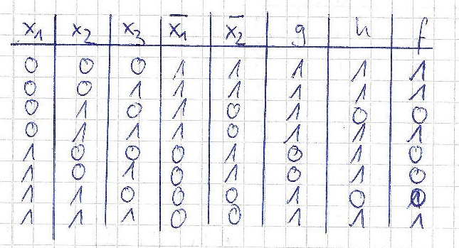
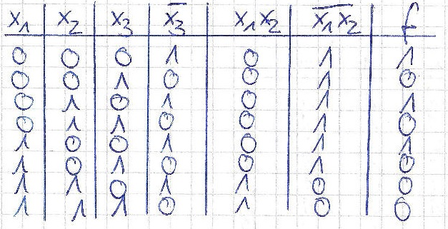

# 3. Übungsblatt
## Aufgabe 8 Schwellenwertelemente

Bestimmen Sie die Gewichte und den Schwellenwert einzelner Schwellenwertelemente (kein Netz von Schwellenwertelementen), sodass sie die folgenden Booleschen Funktionen berechnen:
 * a) $x_1 \land x_2 \land \neg x_3$
 Da nur ein Punkt von den anderen Punkten durch eine Ebene getrennt werden muss, kann man diese durch probieren herausfinden.
 
 

 * b) $\neg x_1 \lor (\neg x_2 \land x_3)$
 Wahheitstabelle:
 $\begin{array}(c|c|c|c|c|c|c)
 x_1 & x_2 & x_3 & \neg x_1 & \neg x_2 & \neg x_2 \land x_3 & f \\
\hline
 0     & 0     & 0     & 1          & 1          & 0                    & 1 \\
 0     & 0     & 1     & 1          & 1          & 1                    & 1 \\
 0     & 1     & 0     & 1          & 0          & 0                    & 1 \\
 0     & 1     & 1     & 1          & 0          & 0                    & 1 \\
 1     & 0     & 0     & 0          & 1          & 0                    & 0 \\
 1     & 0     & 1     & 0          & 1          & 1                    & 1 \\
 1     & 1     & 0     & 0          & 0          & 0                    & 0 \\
 1     & 1     & 1     & 0          & 0          & 0                    & 0
 \end{array}$

 $\begin{matrix}
(0;0;0) & (0;1;1) &  & A(\frac 12;1;0) \\
(0;0;1) & (1;0;1) &  & B(1;\frac 12;1) \\
(0;1;0) &         &  & C(1;0;\frac 12)
\end{matrix}$

 $(x-A)\cdot [(C-A)\times (B-A)]=0$
 $\vec x - \begin{pmatrix} \frac 12 \\ 1 \\ 0 \end{pmatrix} \cdot \Biggl[\biggl(\begin{pmatrix} 1 \\ 0 \\ \frac 12 \end{pmatrix} - \begin{pmatrix} \frac 12 \\ 1 \\ 0 \end{pmatrix}\biggl) \times \biggl(\begin{pmatrix} 1 \\ \frac 12 \\ 1 \end{pmatrix} - \begin{pmatrix} \frac 12 \\ 1 \\ 0 \end{pmatrix}\biggl)\Biggl] = 0$

 $\vec x - \begin{pmatrix} \frac 12 \\ 1 \\ 0 \end{pmatrix} \cdot \Biggl[\begin{pmatrix} \frac 12 \\ -1 \\ \frac 12 \end{pmatrix} \times \begin{pmatrix} \frac 12 \\ -\frac 12 \\ 1 \end{pmatrix}\Biggl] = 0$

 $\vec x - \begin{pmatrix} \frac 12 \\ 1 \\ 0 \end{pmatrix} \cdot \begin{pmatrix} -\frac 34 \\ -\frac 14 \\ \frac 14 \end{pmatrix} = 0$

 $-\frac 34 x_1 + \frac 38 - \frac 14 x_2 + \frac 14 + \frac 14 x_3 =0$
 $-6x_1+3-2x_2+2+2x_3=0$
 $-6x_1-2x_2+2x_3+5=0$
 

 * c) $(\neg x_1 \lor x_2)\land (\neg x_2 \lor x_3)$
 Wahrheitstabelle

 $(0;0;0);(0;0;1);(0;1;1);(1;1;1)$
Keine Lösung möglich, da sich keine Ebene zum trennen der Punkte aufspannen lässt.

 * d) $\neg (x_1 \land x_2)\land \neg x_3$
 
 $(0;0;0);(0;1;0);(1;0;0)$
 

 $A(0;0;\frac12);B(1;\frac 12;0);C(\frac 12; 1;0)$

 $(x-A)\cdot [(C-A)\times (B-A)]=0$
 $\vec x - \begin{pmatrix} 0 \\ 0 \\ \frac 12 \end{pmatrix} \cdot \Biggl[\biggl(\begin{pmatrix} \frac 12 \\ 1 \\ 0 \end{pmatrix} - \begin{pmatrix} 0 \\ 0 \\ \frac 12 \end{pmatrix}\biggl) \times \biggl(\begin{pmatrix} 1 \\ \frac 12 \\ 0 \end{pmatrix} - \begin{pmatrix} 0 \\ 0 \\ \frac 12 \end{pmatrix}\biggl)\Biggl] = 0$

 $\begin{pmatrix} x_1 \\ x_2 \\ x_3-\frac 12 \end{pmatrix} \cdot \Biggl[\begin{pmatrix} \frac 12 \\ 1 \\ -\frac 12 \end{pmatrix} \times \begin{pmatrix} 1 \\ \frac 12 \\ -\frac 12 \end{pmatrix}\Biggl] = 0$

 $-\frac 14 x_1 - \frac 14 x_2 - \frac 34 x_3 +\frac 38 = 0$

 $-2x_1-2x_2-6x_3=-3$
 

 ---

## Aufgabe 9 Schwellenwertelemente
**Gegeben sei eine Menge von Punkten in einem zweidimensionalen Raum (also Punkte in einer Ebene). Für eine festgelegte Teilmenge dieser Punkte soll ein Schwellenwertelement eine Ausgabe von 1 erzeugen, für die übrigen eine Ausgabe von 0.**
 * **a) Unter welchen Bedingungen kann ein Schwellenwertelement diese Aufgabe lösen?**

 Wenn das Problem linear separabel ist.
 (bedeutet: "Durch eine Gerade ist die Teilmenge abgrenzbar")

 * **b) Wenn die Aufgabe lösbar ist: Ist sie eindeutig lösbar? D.h.: Gibt es einen eindeutigen Satz von Gewichten und einen eindeutigen Schwellenwert, sodass die Aufgabe gelöst wird? Wenn nicht: Welche Variationsmöglichkeiten gibt es?**

 Nein, es gibt keinen eindeutigen Satz von Gewichten und Schwellenwerten, man kann diese zB skalieren.
        Beispiel:
        Löse Funktion x1 and x2
        mögliche Gewichte und Schwellenwerte sind:
        w1 = 1; w2 = 1 und Teta = 2 ,
        oder w1 = 2 und w2 = 2 und Teta = 4

 * **c) Wie könnte man in natürlicher Weise eine „beste“ Lösung der Aufgabe definieren?**
 
 Der Strich als Grenze der von beiden Teilmengen den gleichen, optimalen Abstand hat.

  ---

## Aufgabe 10 Netze von Schwellenwertelementen
 * **a) Geben Sie ein neuronales Netz aus Schwellenwertelementen an, das für Punkte $(x_1,x_2)$ innerhalb des in der nebenstehenden Skizze gezeigten Dreiecks den Wert 1 und für Punkte außerhalb den Wert 0 liefert!**
 *

 
### a) 3 Neuronen, die jeweils die 3 Geraden modellieren
    1. Neuron (Gerade von P(1/3) nach P(3/3))
            w1 = 0
            w2 = -1
            Teta = -3
    2. Neuron (Gerade von P(2/3) nach P(1/3))
            w1 = 2
            w2 = 1
            Teta = 5
    3. Neuron (Gerade von P(3/3) nach P(2/1))
            w1 = -2
            w2 = 1
            Teta = -3
    Siehe Bild, diese 3 Neuronen zusammengeschaltet mit jeweils Gewicht 1 und Teta = 3 (oder Gewicht 2 und Teta = 6 etc. siehe 9b) berechnet 1 für alle Punkte innerhalb des Dreiecks und 0 für ausserhalb.

### b)
**Es soll innerhalb eines Gebietes der $x_1-x_2$ - Ebene, das durch ein Polygon begrenzt, aber nicht konvex ist, die Ausgabe 1, und außerhalb die Ausgabe 0 erzeugt werden. Welches Problem kann in diesem Fall im Vergleich zu dem oben betrachteten Dreieck auftreten? Wie kann man dieses Problem lösen?**

Durch konkarve Form (z.B. C-Form) können Flächen entstehen bei denen sich die einzelnen Entscheidungsgrenzen widersprechen.

Lösen ließe sich das Problem durch Zerteilen in konvexe Teilbereiche, die dann mit logischem oder verknüpft werden.

 ---

## Aufgabe 11 Berechnungsfähigkeiten von Netzen von Schwellenwertelementen
Kann man ein Netz aus Schwellenwertelementen angeben, das für Punkte innerhalb eines Kreises mit Radius 1 um den Ursprung die Ausgabe 1 und außerhalb die Ausgabe 0 liefert? Wenn ja, skizzieren Sie dieses Netz! Wenn nein, geben Sie ein Prinzip an, wie man ein Netz bestimmen kann, das eine Näherungslösung liefert!

Ja, man könnte sich RBF-Netze zu Nutze machen. (Radiale Basisfuntkionsnetze)
Bislang hat man immer nur nach folgender Form die Aktivierungsfunktion des Neurons berechnet: w_i * x_i - Teta = 0 bzw. w_i * x_i <= Teta
War diese Formel erfüllt so "feuert" das Neuron.
Bei RBF Netzen sieht die Aktivierungsfunktion wie folgt aus, die Gewichte stellen nun das Zentrum des Kreises dar und der Schwellwert den Radius des Kreises.
Damit ein Punkt nun innerhalb des Kreises liegt muss nur folgende Aktivierungsfunktion erfüllt sein.
Hier im konkreten Beispiel mit w1 = 0 und w2 = 0 und Teta = 1 (Radius 1)

sqrt((x1 - w1)^2 + (x2-w2)^2) <= 1 (Teta)
