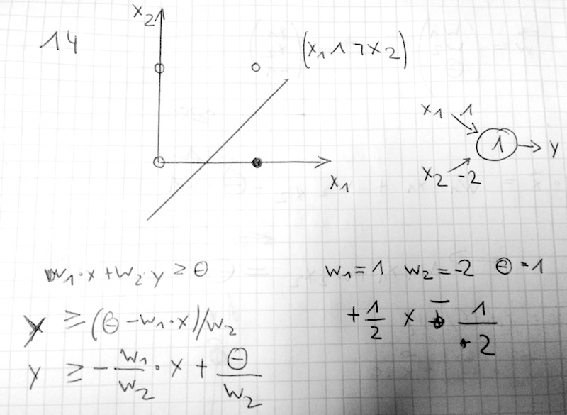

# 4. Übungsblatt
## Aufgabe 12 Schwellenwertelemente: Darstellung Boolescher Funktionen
**Geben Sie einen Algorithmus an, der zu einer beliebigen gegebenen Booleschen Funktion f : {0, 1}n → {0, 1} ein Netz aus Schwellenwertelementen mit höchstens drei Schichten liefert, das diese Funktion berechnet! (Das Netz soll konstruiert, nicht durch Beispiele trainiert werden! Hinweis: vgl. Aufgaben des letzten Übungsblatts)**

Idee: Disjunktive Normalform:
Alle Funktionen $f = D_1 \lor D_2 \lor ... D_n$
wobei D1 bis Dn jeweils aus Literalen L bestehen.
$D_i = L_i1 \land L_i2 \land ... L_ij$ , wobei $L_ik = x_k oder L_ik = \neg x_ik$

$D_i$ ist ein Neuron

$L_ij hat Gewichte w_ik = { 2 falls l_ik = x_k
                            -2 falls l_ik = \neg x_k

        Teta_i = j-1 + 1/2 \sum w_it$

        Ergebnis in der 3. Schicht
  1 Ausgabeneuron mit n-Eingängen    

  (aus Neuronalen Netzen wo man zeigen soll dass jede Bool'sche Funktion mit Netzen aus 2 Schichten liefert. 3. Schicht sind die Eingaben selber (x_ik) Hat er ja in der Übung gesagt, dass es darauf ankommt ob man eingabeschicht mitzählt oder nicht. Zwischenschicht wäre dann mehrere Neuronen D_i und diese wiederum werden dann verundet in der 3. Schicht zu dem Ausgabeneuron.

---
## Aufgabe 13 Trainieren von Schwellenwertelementen
**In der Vorlesung wurde der Lernvorgang eines Schwellenwertelementes für das logische AND behandelt. Hier soll nun die logische Negation betrachtet werden.**

**Geben Sie anhand einer anschaulichen Darstellung der Fehlerfunktion an, wie der Lernvorgang verläuft für**

Alle Aufgaben nach *ONLINE-Lernen* gelöst (Rückführung der Ergebnis nach jedem Schritt)
vs. *BATCH-Lernen* Korrektur nach Durchführen aller Möglichkeiten einer Belegung

a) **Startwerte $w = 2$ und $\Theta = -2$, Lernrate $\frac{1}{3}$**

Nach Delta-Regel:

| Epoche | $x$ | $d=\neg x$ | $x*w$ | $f(x)$ | $\epsilon$ | $\Delta w$ | $\Delta \Theta$| $w$| $ \Theta$ |
| :--- | :---: | :---: | :---: | :---: |
| 1 | 0 | 1 | 0 | 0 | 1 |  0  | |  2  | -2 |
| 2 | 1 | 0 | 2 | 0 | 1 |-1/3 | | 5/3 | - |

|  x  |  dw  |  dT | w | T |
| :---: | :---: | :---: | :---: |
|0|0 | -0 | 2 | -2 |
|1|-0.33 | 0.33 | 1.66 | -1.66 |
|0|0 | -0 | 1.66 | -1.66 |
|1|-0.33 | 0.33 | 1.33 | -1.33 |
|0|0 | -0 | 1.33 | -1.33 |
|1|-0.33 | 0.33 | 1 | -1 |
|0|0 | -0 | 1 | -1 |
|1|-0.33 | 0.33 | 0.66 | -0.66 |
|0|0 | -0 | 0.66 | -0.66 |
|1|-0.33 | 0.33 | 0.33 | -0.33 |
|0|0 | -0 | 0.33 | -0.33 |
|1|-0.33 | 0.33 | 0 | 0 |
|0|0 | -0 | 0 | 0 |
|1|-0.33 | 0.33 | -0.33 | 0.33 |
|0|0 | -0.33 | -0.33 | 0 |

b) **Startwerte $w = 1$ und $\Theta = 2$, Lernrate $\frac{1}{2}$**

|  x  |  dw  |  dT | w | T |
| :---: | :---: | :---: | :---: |
|0|0.0 | -0.5 | 1.0 | 1.5 |
|1|0.0 | -0.0 | 1.0 | 1.5 |
|0|0.0 | -0.5 | 1.0 | 1.0 |
|1|-0.5 | 0.5 | 0.5 | 1.5 |
|0|0.0 | -0.5 | 0.5 | 1.0 |
|1|0.0 | -0.0 | 0.5 | 1.0 |
|0|0.0 | -0.5 | 0.5 | 0.5 |
|1|-0.5 | 0.5 | 0.0 | 1.0 |
|0|0.0 | -0.5 | 0.0 | 0.5 |
|1|0.0 | -0.0 | 0.0 | 0.5 |
|0|0.0 | -0.5 | 0.0 | 0.0 |
|1|-0.5 | 0.5 | -0.5 | 0.5 |
|0|0.0 | -0.5 | -0.5 | 0.0 |

c) **Startwerte $w=2$ und $\Theta = 1$, Lernrate $\frac{1}{10}$**

|  x  |  dw  |  dT | w | T |
| :---: | :---: | :---: | :---: |
|0|0.0 | -0.1 | 2.0 | 0.9 |
|1|-0.1 | 0.1 | 1.9 | 1.0 |
|0|0.0 | -0.1 | 1.9 | 0.9 |
|1|-0.1 | 0.1 | 1.8 | 1.0 |
|0|0.0 | -0.1 | 1.8 | 0.9 |
|1|-0.1 | 0.1 | 1.7 | 1.0 |
|0|0.0 | -0.1 | 1.7 | 0.9 |
|1|-0.1 | 0.1 | 1.6 | 1.0 |
|0|0.0 | -0.1 | 1.6 | 0.9 |
|1|-0.1 | 0.1 | 1.5 | 1.0 |
|0|0.0 | -0.1 | 1.5 | 0.9 |
|1|-0.1 | 0.1 | 1.4 | 1.0 |
|0|0.0 | -0.1 | 1.4 | 0.9 |
|1|-0.1 | 0.1 | 1.3 | 1.0 |
|0|0.0 | -0.1 | 1.3 | 0.9 |
|1|-0.1 | 0.1 | 1.2 | 1.0 |
|0|0.0 | -0.1 | 1.2 | 0.9 |
|1|-0.1 | 0.1 | 1.1 | 1.0 |
|0|0.0 | -0.1 | 1.1 | 0.9 |
|1|-0.1 | 0.1 | 1.0 | 1.0 |
|0|0.0 | -0.1 | 1.0 | 0.9 |
|1|-0.1 | 0.1 | 0.9 | 1.0 |
|0|0.0 | -0.1 | 0.9 | 0.9 |
|1|0.0 | -0.0 | 0.9 | 0.9 |
|0|0.0 | -0.1 | 0.9 | 0.8 |
|1|-0.1 | 0.1 | 0.8 | 0.9 |
|0|0.0 | -0.1 | 0.8 | 0.8 |
|1|0.0 | -0.0 | 0.8 | 0.8 |
|0|0.0 | -0.1 | 0.8 | 0.7 |
|1|-0.1 | 0.1 | 0.7 | 0.8 |
|0|0.0 | -0.1 | 0.7 | 0.7 |
|1|0.0 | -0.0 | 0.7 | 0.7 |
|0|0.0 | -0.1 | 0.7 | 0.6 |
|1|-0.1 | 0.1 | 0.6 | 0.7 |
|0|0.0 | -0.1 | 0.6 | 0.6 |
|1|0.0 | -0.0 | 0.6 | 0.6 |
|0|0.0 | -0.1 | 0.6 | 0.5 |
|1|-0.1 | 0.1 | 0.5 | 0.6 |
|0|0.0 | -0.1 | 0.5 | 0.5 |
|1|0.0 | -0.0 | 0.5 | 0.5 |
|0|0.0 | -0.1 | 0.5 | 0.4 |
|1|-0.1 | 0.1 | 0.4 | 0.5 |
|0|0.0 | -0.1 | 0.4 | 0.4 |
|1|0.0 | -0.0 | 0.4 | 0.4 |
|0|0.0 | -0.1 | 0.4 | 0.3 |
|1|-0.1 | 0.1 | 0.3 | 0.4 |
|0|0.0 | -0.1 | 0.3 | 0.3 |
|1|0.0 | -0.0 | 0.3 | 0.3 |
|0|0.0 | -0.1 | 0.3 | 0.2 |
|1|-0.1 | 0.1 | 0.2 | 0.3 |
|0|0.0 | -0.1 | 0.2 | 0.2 |
|1|0.0 | -0.0 | 0.2 | 0.2 |
|0|0.0 | -0.1 | 0.2 | 0.1 |
|1|-0.1 | 0.1 | 0.1 | 0.2 |
|0|0.0 | -0.1 | 0.1 | 0.1 |
|1|0.0 | -0.0 | 0.1 | 0.1 |
|0|0.0 | -0.1 | 0.1 | 0.0 |
|1|-0.1 | 0.1 | -0.0 | 0.1 |
|0|0.0 | -0.1 | 0.0 | 0.0 |
|1|-0.1 | 0.1 | -0.1 | 0.1 |
|0|0.0 | -0.1 | -0.1 | 0.0 |

**Geben Sie eine geometrische Interpretation der Lernergebnisse an!**

Habe die Delta-Regel angewandt. Delta w berechnet sich aus x*epsilon*Lernrate, Delta Theta berechnet sich aus -epsilon*LERNRATE !! 

zu a) Fehler immer zwishen 0 und -1 an den beiden Lernbeispielen, bis im letzten lernschritt fehler 1 im 1. beispiel und 0 im 2. --> Gewichte -1/3 und Theta 0

b) Fehler schwankt immer zwischen 1 bzw. 0 und in nächster Epoche 1 bzw. -1  bis Gewicht -1/2 und Theta 0

c) Fehler immer zwischen 1 und -1, lernrate ziemlich gering, nicht zu ende ausgerechnet...weil viele lernepochen nötig.

---
## Aufgabe 14 Trainieren von Schwellenwertelementen
**Geben Sie den Ablauf des Lernvorgangs (Delta-Regel) eines Schwellenwertelementes für die Boolesche Funktion $x_1 \land \neg x_2$ an! (Am besten mithilfe einer Tabelle, die Spalten für die Werte von x1, x2, $d = x_1 \land \neg x_2$, x·w, y, e (Fehler), ∆w1, ∆w2, ∆θ, w1, w2 und θ enthält.) Verwenden Sie als Anfangsbelegung des Gewichtsvektors w = (0, 0, 0) und als Lernrate 1. Geben Sie eine geometrische Interpretation des Lernergebnisses an!**

$d=x_1 \land \neg x_2$

|  | $x_1$ | $x_2$ | $d$ | $x*w$ | $y$ | $\epsilon$ | $\Delta w_1$ | $\Delta w_2$ | $\Delta \Theta$| $w_1$| $w_2$| $ \Theta$ |
| :---: | :---: | :---: | :---: |
|0|  0 |  0 | 0 |  0  | 1 | 1 |  0  |  0  |  1 |  0 |  0 | 1 |
| |  0 |  1 | 0| -1  | 0 | 0|  0  |  0  |  0|  0 |  0 | 1 |
| |  1 |  0 | 1| -1  | 0 | 1|  1  |  0  | -1|  1 |  0 | 0 |
| |  1 |  1 | 0|  1  | 1 | 1| -1  | -1  |  1|  0 | -1 | 1 |
||
|1|  0 |  0 | 0| -1  | 0 | 0|  0  |  0  |  0|  0 | -1 | 1 |
| |  0 |  1 | 0| -2  | 0 | 0|  0  |  0  |  0|  0 | -1 | 1 |
| |  1 |  0 | 1| -1  | 0 | 1|  1  |  0  | -1|  1 | -1 | 0 |
| |  1 |  1 | 0|  0  | 1 | 1| -1  | -1  |  1|  0 | -2 | 1 |
||
|2|  0 |  0 | 0| -1  | 0 | 0|  0  |  0  |  0|  0 | -2 | 1 |
| |  0 |  1 | 0| -3  | 0 | 0|  0  |  0  |  0|  0 | -2 | 1 |
| |  1 |  0 | 1| -1  | 0 | 1|  1  |  0  | -1|  1 | -2 | 0 |
| |  1 |  1 | 0| -1  | 0 | 0|  0  |  0  |  0|  1 | -2 | 0 |
||
|3|  0 |  0 | 0|  0  | 1 | 1|  0  |  0  |  0|  1 | -2 | 0 |
| |  0 |  1 | 0| -2  | 0 | 0|  0  |  0  |  0|  1 | -2 | 0 |
| |  1 |  0 | 1| -1  | 0 | 1|  1  |  0  | -1|  1 | -2 | 0 |
| |  1 |  1 | 0| -1  | 0 | 0|  0  |  0  |  0|  1 | -2 | 0 |
||
|4|  0 |  0 | 0|  0  | 1 | 1|  0  |  0  |  1|  1 | -2 | 1 |
| |  0 |  1 | 0| -3  | 0 | 0|  0  |  0  |  0|  1 | -2 | 1 |
| |  1 |  0 | 1|  1  | 1 | 0|  0  |  0  |  0|  1 | -2 | 1 |
| |  1 |  1 | 0| -2  | 0 | 0|  0  |  0  |  0|  1 | -2 | 1 |
||
|5|  0 |  0 | 0| -1  | 0 | 0|  0  |  0  |  0|  1 | -2 | 1 |
| |  0 |  1 | 0| -3  | 0 | 0|  0  |  0  |  0|  1 | -2 | 1 |
| |  1 |  0 | 1|  1  | 1 | 0|  0  |  0  |  0|  1 | -2 | 1 |
| |  1 |  1 | 0| -2  | 0 | 0|  0  |  0  |  0|  1 | -2 | 1 |
||

Endergebnis nach Deltaregel: w1 = 1, w2 = -2 Theta = 1

---
## Aufgabe 15 Gradientenabstieg
**Wie in der Vorlesung erläutert, werden neuronale Netze durch Gradientenabstieg trainiert. D.h., man berechnet den Gradienten der Fehlerfunktion bzgl. der Parameter des neuronalen Netzes (Gewichte und Biaswerte) und bewegt sich dann ein kleines Stück (durch die Lernrate und die Größe des Gradienten bestimmt) in die dem Gradienten entgegengesetzte Richtung. (Der Gradient gibt ja die Richtung der stärksten Steigung der Funktion an, wir wollen aber den Fehler minimieren, daher müssen wir uns in die Gegenrichtung bewegen.) In dieser Aufgabe veranschaulichen wir uns dieses Verfahren anhand der Minimierung einer einstelligen Funktion. Der Gradient ist in diesem Fall einfach die Ableitung der Funktion nach ihrem Argument. Wir betrachten die Funktion**
$$ f(x) = \frac{(x + 4)(x + 2)(x + 1)(x - 3)}{20} + 2 $$
**Versuchen Sie, das Minimum dieser Funktion durch Gradientenabstieg zu bestimmen!**

a) **mit Startwert $x_0 = 3$ und Lernrate η = 0.05,**

b) **mit Startwert $x_0 = -0.5$ und Lernrate η = 0.95,**

c) **mit Startwert $x_0 = -2$ und Lernrate η = 0.2.**

**Veranschaulichen Sie den Vorgang durch eine Skizze! Welche Probleme treten auf?**

Gradientenabstieg:
$x_{n+1} = x_n - Lernrate * grad f(x_n)$

$grad f(x_n) = f'(x_n)$

Habe als Ableitung folgendes erhalten: $f'(x) = 1/5 x^3 + 3/5 x^2 - 7/10 x - 17/10$

Am besten mal die funktion bei wolfram alpha plotten lassen.

a) konvergiert langsam von 3 auf 2,65 in immer kleineren schritten gegen 2 (x_6 war bei mir inklusive möglicher Rechenfehler 2,03)

b) wir springen immer hin und her (siehe Plot) auf 0,6 nach 2,4 nach -0,35 auf 0,969 auf 2,5 usw.
  Lernrate scheint zu groß zu sein.

c) Starten bei -2 und x_n wird immer kleiner (x_4 = -2,469)
   Werden wohl im lokalen Minima (siehe Plot wolfram alpha) landen.

Fazit: Beende Gradientenverfahren wenn die Änderung der Näherung einen Grenzwert unterschreitet.
Lernrate zu groß führt zu ungünstigen Sprüngen.
-> Gradientenabstiegsverfahren findet nur lokale Minima egal wie, aber man sollte die Lernrate vieleicht nach jedem Lernschritt anpassen, um schneller zu "guten" Ergebnissen zu kommen.
