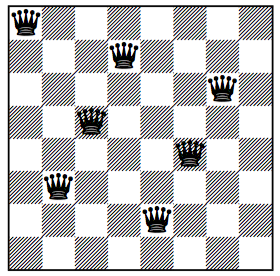
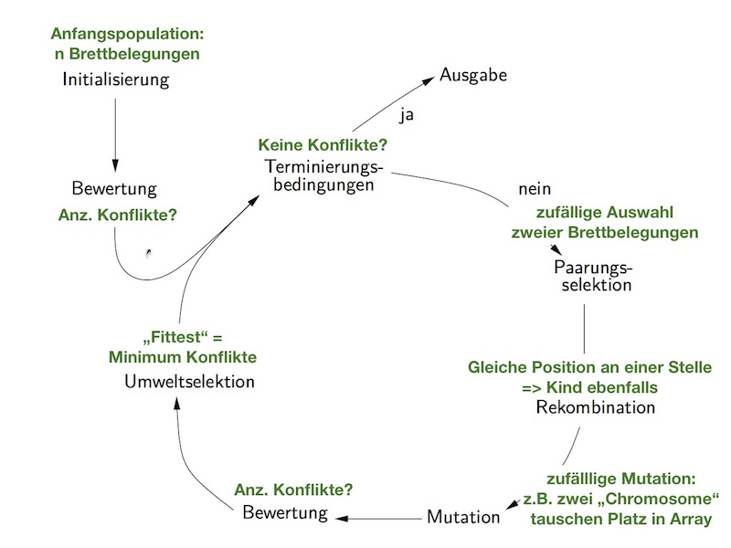
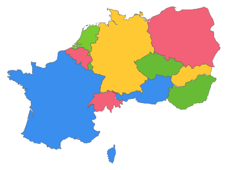
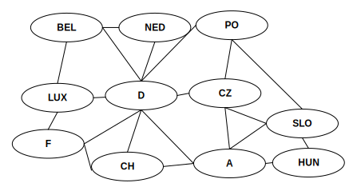

# Aufgabenblatt 5

## Aufgabe 16 Evolutionstheorie
**Die biologische Evolutionstheorie wird z.B. von den sogenannten Kreationisten (die glauben, dass der Schöpfungsbericht der Bibel wortwörtlich richtig ist) heftig kritisiert, und zwar unter anderem mit dem folgenden Argument:
„Die Evolutionstheorie kann die Komplexität der Lebewesen nicht erklären, denn sie beruht ja auf blindem, zufälligem Probieren. Sie behauptet im Grunde, dass man einen VW-Käfer erhalten kann, indem man einen Haufen Schrott in einen Kasten schüttet, und dann diesen Kasten lange genug schüttelt. Aber es ist doch offensichtlich, dass man so keine Autos bauen kann. Das Vorhandensein derart komplexer Dinge wie Autos, geschweige denn Lebewesen, kann man nur durch Annahme eines Schöpfers erklären.“**

* **a) Was ist an dem Argument richtig, was falsch?**
  * *falsch:* Komplexe Kombination (Mutation, Selektion, Genfluss und Gendrift) - kein reines Schütteln (man müsste autobauer und Schweisser mitschütteln)
  * *falsch:* nicht zufälliges Probieren -> beste Anpassung setzt sich durch
  * *falsch:* Es erfolgt eine natürliche Auslese. Diese Auslese erfolgt in dem Kasten nicht.

* **b) Was würden Sie einem Kreationisten, der dieses Argument vorträgt, antworten?**
  * nicht vergleichbar, da Änderungen in der Biologie durch Mutation, Selektion, Genfluss und Gendrift möglich <-> Metallverarbeitung nicht
  * Genfluss nicht möglich (geschlossene Box)
  * Es fehlt an einer Auswahlmethode (Fitnessfunktion)

* **c) Warum funktionieren evolutionäre Algorithmen (obwohl gegen sie ein analoges Argument vorgebracht werden kann)?**
  * Simulieren Evolution durch Aufstellen einer Auswahlmethode und immer wiederkehrende Änderungen der "Kandidaten"
  * analoges Argument: "Es ist nichts anderes als Ausprobieren/intelligenteres BruteForcing" -> Klappt aber

---
## Aufgabe 17 n-Damen-Problem
**Beim n-Damen-Problem geht es darum, n gleichfarbige Damen (Figur beim Schachspiel, die horizontal, vertikal und diagonal beliebig weit ziehen kann) so auf einem n × n-Schachbrett aufzustellen, dass keine auf einem Feld steht, auf das eine andere ziehen könnte, keine Dame also einer anderen „im Weg steht“. Dürften Figuren gleicher Farbe einander schlagen, könnte man auch sagen: so, dass keine eine andere schlagen kann.
Das nebenstehende Diagramm zeigt keine Lösung des 8- Damen-Problems, da nur sieben Damen aufgestellt sind und keine weitere mehr platziert werden kann.
Geben Sie an, wie man das n-Damen-Problem mithilfe eines evolutionären Algorithmus lösen könnte. Gehen Sie dabei auf die folgenden Punkte ein:**

 
* **a) Erklären Sie die Elemente eines evolutionären Algorithmus mithilfe des generischen Grundalgorithmus aus der Vorlesung.**

```
Algorithmus 1 EA-Schema
Eingabe: Optimierungsproblem t←0
  pop(t) ← Erzeuge Population der Größe μ /*(2) Anfangspopulation*/
  Bewerte pop(t) /*(3) Bewertungsfunktion*/
  while not Terminierungsbedingung /*(7)*/ {
    pop1 ← Selektiere Eltern für λ Nachkommen aus pop(t)
    pop2 ← /*(5) - Crossover*/
    pop3 ← Mutiere die Individuen in pop2 /*(5) - Mutation*/
    Bewerte pop3 /*(3) Bewertungsfunktion*/
    t←t+1
    pop(t) /*(4) Auswahlmethode*/
  }
return Bestes Individuum aus pop(t)
```

  1. *Kodierungsvorschrift*: Kodierung der Lösungskadidaten (im Grundalgorithmus nicht gegeben)
  * *Anfangspopulation*
  * *Bewertungsfunktion*: Umgebung darstellen und Güte der Individuen bestimmend
  * *Auswahlmethode*: Wählt unverändert Individuen in nächste Generation
  * *Genetische Operatoren*:
    * Mutation (Zufälliger Veränderung)
    * Crossover (Zerteilt und Rekombiniert)
  * *Parameterwerte* (Populationsgröße, Mutationsw'keit)
  * *Abbruchkriterium* (Mindestgüte, max. Generationenanz, Genanz ohne Verbesserung)

* **b) Versuchen Sie anschaulich zu machen, wie der evolutionäre Algorithmus eine Lösung findet.**


* **c) Entwerfen Sie eine Kodierung für die Lösungskandidaten, sodass jeder Kandidat anhand einer Zeichenkette eindeutig beschrieben werden kann.**

  *Hinweis: In jeder Zeile kann nur eine Dame stehen. Lösungen mit mehr als einer Dame in einer Zeile können so schon durch die Kodierung ausgeschlossen werden.*

 * Array mit n-Feldern
    * Position im Array = Zeile
    * Wert = Spalte
 * Es können niemals in zwei gleiche Werte im Array vorkommen!

* **d) Welche Fitnessfunktion käme in Frage? Welche Variations- und Rekombinationsoperatoren wären geeignet?**
 * *Fitnessfunktion* = Anzahl Konflikte
 * *Kombination*: Gleiche Position an einer Stelle in Array -> Kind ebenfalls
 * *Variationsfunktion*: Zufällig zwei Spalten im Array tauschen

* **e) Welche Funktion haben Variation und Rekombination anschaulich?**
 * *Rekombination*: "Bewertes erhalten"
 * *Variation*: "Ggf. bessere Optionen finden"
---
## Aufgabe 18 Vierfarbenproblem
**Das Vierfarbenproblem ist eines der berühmtesten Probleme der Mathematik. Es besteht aus der Frage, ob jede Landkarte mit höchstens vier Farben so eingefärbt werden kann, dass keine zwei Staaten mit gemeinsamer Grenze die gleiche Farbe haben. Dieses Problem, das im Jahre 1852 von Francis Guthrie aufgeworfen wurde (publiziert 1878), war lange ungelöst. Erst im Jahre 1976 konnten Wolfgang Haken und Kenneth Appel den Vierfarbensatz mithilfe eines umfangreichen Computerprogramms beweisen.**



* **a) Betrachten Sie eine (politische) Karte von Mitteleuropa mit den Staaten Belgien, Deutschland, Frankreich, Luxemburg, Niederlande, Österreich, Polen, Schweiz, Slowakei, Tschechische Republik und Ungarn. Wie kann man für diese Karte eine dem Vierfarbensatz genügende Färbung mithilfe eines evolutionären Algorithmus finden?**
  * Karte als Graph:
    * Länder als Knoten
    * Gemeinsame Grenzen als Kanten
  * *Terminierungsbedingung*: keine Konflikte mehr
  * *Fitnessfunktion:* Anzahl der Kollissionen (minimieren)
  * *Kombination*: Gleiche Färbung von Knoten -> Kindgraph gleiche Färbung für diesen Knoten
  * *Variationsfunktion*: Zufällig zwei Spalten im Array tauschen

* **b) Verallgemeinern Sie den Ansatz aus Teilaufgabe a) auf beliebige Graphenfärbungsprobleme: Bestimmen von Farben für die Knoten eines Graphen, sodass keine zwei Knoten, die durch eine Kante verbunden sind, gleiche Farbe haben.**
  * da a) auch Lösung als Knoten und Kanten, gleicher Ansatz.
    

---
## Aufgabe 19 Genetische Programmierung: SR-Agent
**Geben Sie einen Algorithmus an, der einen zufälligen Lisp/Scheme-Ausdruck erzeugt, wie er in der Vorlesung zur Darstellung der Programme für den Stimulus-Response-Agenten der Gitterwelt verwendet wurde!
Verwenden Sie als Operatoren if, and, or und not und als Konstanten/Variablen east, north, west, south (Aktionen), s1, s2, ... , s8 (Sensoreingaben). Sehen Sie als Parameter die maximale Verschachtelungstiefe des Ausdrucks vor.**
