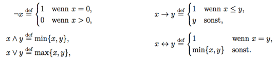

# Übungsblatt 6

## Aufgabe 20: Mehrwertige Logiken
**Betrachten Sie die n-wertigen Logiken $L_n(n\leq 2)$ mit den Wahrheitswerten $T=\biggl\{0=\frac{0}{n-1}, \frac{1}{n-1}, \frac{2}{n-1}, ... ,\frac{n-2}{n-1}, \frac{n-1}{n-1}=1\biggl\}$. Die logischen Verknüpfungen in $L_n$ seien wie folgt definiert:**

**Offensichtlich entspricht die Logik $L_2$ mit den Wahrheitswerten $T_2 = \{0, 1\}$ der klassischen, zweiwertigen Aussagenlogik.**

* a) **Berechnen Sie die Wahrheitswerte von folgendem logischen Ausdruck in der dreiwertigen Logik $L_3$ für alle Kombinationen von $T_3$ der logischen Variablen $x, y, z$ in der Formel $(x \rightarrow y) \land (y \rightarrow z)$.**

* b) **Berechnen Sie in der vierwertigen Logik $L_4$ die Wahrheitstabelle für die Formel $x \leftrightarrow y$.**

---
## Aufgabe 21: Fuzzy-Logik
a) **Informieren Sie sich über das sogenannte „Sandhaufen-Paradoxon“ bzw. Sorites-Paradoxon. Beachten Sie dabei insbesondere die folgenden Fragestellungen:**

 * 100 Sandkörner = ein Haufen sind
 * Haufen - 1 = weiterhin einen Haufen.
 * Weil 100 Sandkörner ein Haufen sind, sind auch 99 Sandkörner ein Haufen; weil aber 99 Sandkörner ein Haufen sind, sind auch 98 Sandkörner ein Haufen usw.
 * -> bereits ein Sandkorn ist ein Haufen.
Das ist eine Aussage, die wir intuitiv nicht akzeptieren wollen.

 **Zu welchem Zweck wird es im Kontext der klassischen Logik angeführt?**
 * Die Haufenparadoxie wird häufig als Argument für die Fuzzylogik angeführt

  **Wo liegen die Probleme in der Modellierung des im Paradoxon enthaltenen und anderer natürlichsprachlicher Konzepte?**

    * "Haufen" ist ein unpräziser Begriff
      * keine definierte Mindestanzahl
      * erforderliche räumliche Anordnung (Anordnung in Linie ist kein Haufen!)

  **Welche Möglichkeiten bietet die Einführung von Fuzzy-Logik in diesem Zusammenhang?**
    * Unscharfe Grenzen können berücksichtigt werden

b) **Betrachten Sie die folgenden natürlichsprachlichen Ausdrücke:**
 * **Das Auto fährt langsam/schnell.**
 * **Der Güterzug ist kurz/lang.**
 * **Das Wasser ist kalt / lauwarm / heiß.**

**Geben Sie anhand von Diagrammen mit von Ihnen selbst gewählten Skaleneinteilungen zu den jeweiligen Ausdrücken passende Fuzzy-Repräsentationen an.**

---
## Aufgabe 22: Fuzzy-Regelung
**In der Mensa steht eine Zapfanlage, die aus einem Behälter besteht, in dem sich Wasser befindet, das mit Brause-Konzentrat versetzt wird. An dem Behälter sei ein stufenlos regelbarer Anschluss an eine Wasserleitung angebracht und ein Hahn, der zum Abzapfen der Brause dient.
Gerade zu Stoßzeiten ist der Behälter häufig leer, da viel Brause getrunken wird und das Perso- nal nicht ständig die Zapfanlage im Auge behalten und ggf. nachfüllen kann. Die Abteilungslei- terin des Studentenwerks erkennt das Problem und beauftragt Sie, eine Lösung dafür zu finden. Wegen der stark variierenden Nachfrage an Brause entschließen Sie sich, einen Fuzzy-Regler zu entwerfen.
Hinweis: Sie können davon ausgehen, dass beim Auffüllen des Wassers automatisch eine ad- äquate Menge Brausekonzentrat nachgefüllt wird, und dass ein Quirl in der Zapfanlage die Bestandteile direkt vermischt.**
* a) **Identifizieren Sie alle linguistische Variablen und deren Werte.**
* b) **Geben Sie problemkonforme Fuzzy-Regeln an.**
