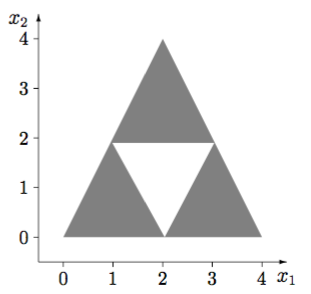
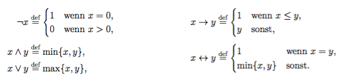

# Übungsblatt 8
## Aufgabe 1 The Legend of Zelda und Netze von Schwellenwertelementen
**Ganondorf hatte Zelda und Link in einen magischen Käfig 4 eingesperrt. Die Situation schien ausweglos, doch plötzlich erschallte ein leisen „Hey!“und die Fee Navi meldete sich zu 3 Wort. „Ihr müsst die Kräfte des Triforce aktivieren um das Böse zu bannen. Nur so könnt ihr den bösen Mächten ent- 2 kommen! “**

**Geben Sie ein neuronales Netz aus Schwellenwertelementen an, das für Punkte (x1,x2) innerhalb des in der nebenstehen- den Skizze gezeigten grau markierten Bereichs den Wert 1 und für Punkte außerhalb den Wert 0 liefert!**

FALSCHE LÖSUNG. 3 Dreiecke machen ist korrekt, diese kombinieren auf 3. Schicht und Theta = 1, da egal welches Dreieck unser Neuronales Netz feuert.
Idee: Geradengleichungen bzw. Normalen.
1. Schritt großes Dreieck modellieren
2. Schritt weißes Dreieck ausschneiden

1. Schritt 3 Geradengleichungen bzw. Normalenvektoren:
Gerade 1: Normale (0/1) ablesbar
Gerade 2:  von P(0/0) nach P(2/4) --> x*(2/4) --> Normale (2/-1)
Gerade 3: von P(2/4) nach P(4/0) --> x*(2/-4) + (0/8) --> Normale (-2/-1)
y-Achsenabschnitt war 8 (wichtig für Schwellwertelement)

Netz modellieren mit wij mit i = gerade und j = 1 für x1 und j = 2 für x2

w11 = 0; w12 = 1; Theta = 0
w21 = 2; w22 = -1; Theta = 0 (kein yAchsenabschnitt bei 2. Gerade)
w31 = -2; w32 = -1; Theta = -8

Alle 3 Neuronen verbindent mit Gewicht 1 zu zweiter Schicht und Theta = 3

2. Schritt: Weißes Dreieck ausschneiden, wieder 3 Geraden

Gerade 1: Normale (0/-1) ablesbar --> (0/2) Y-Achsenabschnitt
Gerade 2: von P(1/2) nach P(2/0) --> x*(1/-2) + (0/4) --> Normale (2/1) y-Achsenabschnitt 4
Gerade 3: von P(2/0) nach P(3/2) --> x*(1/2) + (0/-4) Y-Achsenabschnitt -4

Das heißt nun Netz wie folgt mit Notation aus 1. Schritt:
w11 = 0; w12 = -1; Theta = -2
w21 = 2; w22 = 1; Theta = 4
w31 = -2; w32 = 1; Theta = -4

Diese 3 Neuronen verbindet mit Gewicht 1 zu einem Neuron mit Theta = 3 und von diesem Neuron nun  mit Gewicht -1 (für ausschneiden, wenn Punkt in dem weißen Dreieck) an das Neuron in der 2. Schicht vom großen Dreieck.

8 Neuronen, 3 jeweils für die 3 Geraden, 1 für die Bildung des weißen 3-ecks und 1 für graues Dreieck und ausschneiden des weißen Dreiecks.

---
## Aufgabe 2 Die Zwerge und die Wahrscheinlichkeitsrechnung
**Die Berichte des kleinen Hobbits Bilbo und seiner Gefolgschaft wurden in den letzten Jahren zahlreich wiedergegeben. Viele kennen die Zwerge als Gemeinschaft, denn von ihren Streitig- keiten wurde nur selten berichtet. So kam es, das die sich sonst so einigen Bifur, Bofur und Bombur in einen Streit um das letzte Fass Bier gerieten.**

**Ihre Trefferchance ist mittlerweile stark eingeschränkt: Bifur, der betrunkenste der Drei, konnte sein Ziel nur noch mit einer geschätzten Wahrscheinlichkeit von 0.3 treffen. Bofur schwankte nur wenig, aber sah seine Gegner bereits doppelt. Mit einer Chance von 0.5 sollte er also seinen Gegner treffen können. Bombur der kräftigste unter Ihnen prahlte wie viel er doch vertragen konnte. Zur Demonstration warf er einen Krug in die Luft und zerschmetterte ihn mit seiner Axt. Mit einer Treffsicherheit von 1.0 war er so Zielgenau wir immer.**

**Die drei einigten sich nacheinander zuzuschlagen. Wer einmal getroffen wurde scheidet sofort aus. In der Reihenfolge Bifur, Bofur, Bombur, Bifur, ... konnten sie nun wählen wen sie jeweils angreifen. Was wäre die beste Strategie für Bifur, wenn Bofur und Bombur jeweils den verbleibenden Zwerg mit der höchsten Zielgenauigkeit angreifen würden? Wie hoch ist Bifurs Chance zu gewinnen?**

1. Strategie Immer auf Stärkeren:

  habe Baum aufgezeichnet und kam auf folgende Formel:

  $P(\text{"Bifur Gewinn wenn immer auf den Starkeren"})$ $= \sum_{i=0}^{\inf} (\frac12 * \frac23)^i * \frac1{18}$
  $+ \sum_{i=1}^{\inf} (\frac12 * \frac23)^i * \frac13$
  $+ \frac23 * \frac12 * \frac13 $
  $= \frac1{12} + \frac16$
  $+ \frac19 $
  $ = \frac{13}{36}$

  Richtig:

  Absichtlich erste Runde nicht treffen. Dann so ca. 46,15%

---
## Aufgabe 3 Mario Kart und Mehrwertige Logiken
**Betrachten Sie die n-wertigen Logiken $L_n(n\leq 2)$ mit den Wahrheitswerten**
$$T_n=\{0=\frac{0}{n-1}, \frac{1}{n-1}, \frac{2}{n-1}, ..., \frac{n-2}{n-1}, \frac{n-1}{n-1} = 1\}$$

**Die logischen Verknüpfungen in $L_n$ seien wie folgt definiert:**

**Offensichtlich entspricht die Logik $L_2$ mit den Wahrheitswerten $T_2 = \{0,1\}$ der klassischen, zweiwertigen Aussagenlogik.**

**Christian, Christoph und Alex spielen eine Party Mario-Kart. Nach vielen Runden sind sie sich unsicher unter welchen Bedingungen einer von ihnen gewinnt. Folgende Beziehungen lassen sich aufstellen:**

a) **Alex ist sich sicher, dass gilt: „Wenn ich einen blauen Panzer erhalte und einen Turbo Pilz einsetzen kann, dann werde ich gewinnen.“**
**Stellen sie den im Text beschriebenen Ausdruck für B (blauer Panzer), T (Turbo Pilz) und A (Alex gewinnt) auf. Berechnen sie anschließend die Wahrheitswerte für alle Kombinationen von T3 der logischen Variablen B, T und A.**

Werte bei 3-Wertiger Logik: {0,0.5,1}

Ausdruck: $$ (B \land T) \rightarrow A$$

Wertetabelle aufgeteilt in $$ B\land T$$

3^2 Möglichkeiten, dann 2. Wertetabelle für 3^2 Möglichkeiten, ergibt wieder nur 9.
27 Möglichkeiten ausgezählt.
4 \* 0; 1 \* 0.5; 22 \* 1

b) **Christian und Christoph sind der Meinung, dass dieser Ausdruck viel zu einfach sei und geben folgende Alternative an.**
$$((B \rightarrow A)\land (T \rightarrow A))\land (B \land T).$$
**Berechnen sie erneut die Wahrheitswerte für alle Kombinationen von $T_3$ der logischen Variablen B, T und A.**

3 Wertetabellen für jedes einzelne Konjunkt erstellt (jeweils 3^2 Möglichkeiten)
da diese verundet werden gibt es 3^2 * 3^2 * 3^2 Möglichkeiten, dh 729 Möglichkeiten.

533 \* 0; 124 \* 0.5; 72 \* 1

Man erkennt spätestens hier, dass b) eine andere Aussage ist als a, allein schon anhand der Verteilung von 0; 0.5; 1
