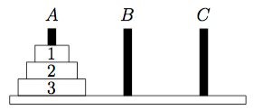
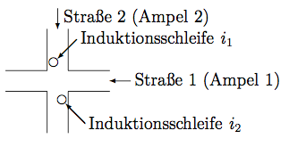
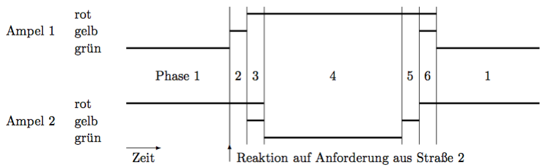
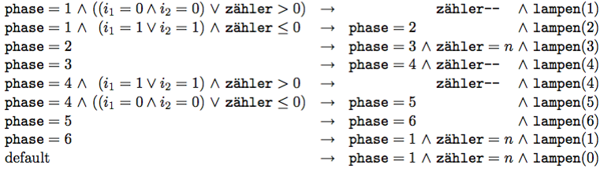

# Übungsblatt 09
## Aufgabe 27 Zustandsautomaten: Stimulus-Response-Agent
*Auf dem 2. Übungsblatt haben wir gesehen, dass man für einen reinen Stimulus-Response- Agenten kein Regelsystem angeben kann, das ihn den Umriss eines Objektes oder des Raumes abfahren lässt, wenn es „enge Zwischenräume“ gibt, d.h. Zwischenräume zwischen einer Wand und einem Objekt oder zwischen zwei Objekten, die nur ein Feld breit sind.
Agenten mit inneren Zuständen können dagegen auch in Gitterwelten mit engen Zwischenräumen ihre Aufgabe erfüllen. Definieren Sie geeignete innere Zustände und geben Sie ein Regelsystem für einen solchen Agenten an!*

(-->sol6.pdf Aufgabe 20)

---
## Aufgabe 28 Zustandsautomaten: Türme von Hanoi
*Das Problem der Türme von Hanoi ist sicherlich aus einer der Grundvorlesungen bekannt. Auf einem von drei Stäben liegt eine Anzahl verschieden großer Scheiben, jede Scheibe auf der nächstgrößeren. Diese Scheiben sollen auf einen anderen der Stäbe umgelagert werden (wobei der dritte Stab als Zwischenlager dienen kann), ohne dass die folgenden Bedingungen verletzt werden:*

* a) *Es darf immer nur eine Scheibe bewegt werden.*
* b) *Scheiben dürfen nur auf Stäben abgelegt werden.*
* c) *Es darf nie eine größere Scheibe auf eine kleinere gelegt werden.*

*Wir betrachten hier das Problem der Türme von Hanoi für drei Scheiben $S_1$ bis $S_3$, wie in der obigen Skizze gezeigt. Der rekursive Algorithmus zur Lösung dieses Problems ist sicher bekannt. Es gibt aber auch einen iterativen: Man bewege stets die größte Scheibe, die bewegt werden kann, ohne den im Schritt vorher gemachten Zug rückgängig zu machen. Man bewege die Scheibe nach rechts (wobei ein Zug von C nach A auch als „nach rechts“ gilt), wenn die Zahl der von der Ausgangsposition an ausgeführten Züge ungerade ist, und man bewege sie nach links (wobei ein Zug von A nach C auch als „nach links“ gilt), wenn diese Zahl gerade ist. Sollte der so bestimmte Zug nicht erlaubt sein oder den vorhergehenden Zug rückgängig machen, bewege man die Scheibe in die andere Richtung.*

*Geben Sie ein Produktionssystem für einen Agenten an, der das Problem der Türme von Hanoi auf die beschriebene Weise löst. Nehmen Sie als mögliche Aktionen die sechs Züge bewege(Scheibe, Richtung) an. Als Sensoreingaben stehen $G_1, G_2$ und $G_3$ zur Verfügung, wobei $G_i$ dann 1 (wahr) ist, wenn die Scheibe Si die größte Scheibe ist, die bewegt werden kann. (Binäre) Zustandsvariablen sind $B_1, B_2, B_3$ und R, für die es die folgenden Zustandsänderungsfunktionen gibt: durch bewegt($B_i$) werden $B_i$ auf 1 und alle $B_j, j\neq i$, auf 0 gesetzt, durch umdrehen wird der Wert von R negiert (ist er 1, so wird er 0 und umgekehrt). Überlegen Sie, ob es (mindestens in natürlicher Sprache) nicht noch eine einfachere Beschreibung des iterativen Algorithmus gibt.*

(--> sol6.pdf)

Um ein Regelsystem für einen Agenten zu finden, der das Türme-von-Hanoi-Problem mit drei Scheiben löst, betrachten wir zunächst eine einfachere Formulierung der iterativen Lösungsmethode (danach war ja auch in der Aufgabe gefragt). Mit Hilfe dieser Formulierung läßt sich das Regelsystem wesentlich leichter aufstellen.
* Bewege in jedem ungeraden Zug die kleinste Scheibe, und zwar immer in die gleiche Richtung (z.B. immer nach rechts).
* Mache in den übrigen Zügen den einzigen, den Regeln entsprechenden Zug, der nicht die kleinste Scheibe bewegt. (Es gibt, wie man sich leicht klar macht, tatsächlich immer nur einen anderen zulässigen Zug.)

Untersucht man das Türme-von-Hanoi-Problem noch etwas genauer, so stellt man fest, daß nicht nur die kleinste Scheibe immer in die gleiche Richtung bewegt wird, sondern daß dies auch für alle übrigen Scheiben gilt: Alle Scheiben mit ungerader Nummer werden in die gleiche Richtung bewegt (z.B. alle nach rechts), alle Scheiben mit gerader Nummer werden in die entgegengesetzte Richtung bewegt (z.B. alle nach links). Auf der Grundlage dieser Erkenntnisse läßt sich ein (erstaunlich einfaches) Regelsystem aufstellen. Von den in der Aufgabenstellung angegebenen internen Zusta ̈nden benutzen wir nur einen: den Zustand R. Er möge im Anfangszustand den Wert 0 haben. In jedem Schritt wird sein Wert invertiert, so daß man an ihm ablesen kann, ob die Zahl der bereits ausgeführten Schritte gerade oder ungerade ist, man folglich die kleinste Scheibe oder eine andere bewegen muß.

$$R=0\rightarrow bewege(S_1,rechts)\land umdrehen$$
$$R=1\land G_2=1\rightarrow bewege(S_2,links)\land umdrehen$$
$$R=1\land G_3=1\rightarrow bewege(S_3,rechts) \land umdrehen$$

Ein Agent mit diesem Regelsystem löst, wie man leicht nachprüft, das Problem. Er bewegt die drei Scheiben vom Stab A auf den Stab B. Er hält sogar im Zielzustand an, da im letzten Zug die Scheibe S1 auf alle anderen, bereits auf den Stab B bewegten Scheiben gelegt wird. Danach ist offenbar R = 1. Weil aber weder G2 = 1 noch G3 = 1 (auf S2 liegt S1, auf S3 liegt S2; beide können also nicht bewegt werden), ist keine Regel anwendbar und folglich bricht das Verfahren ab. Möchte man übrigens die Scheiben vom Stab A auf den Stab C bewegen, so muß man lediglich in dem obigen Regelsystem alle Richtungen umdrehen, also S1 nach links bewegen, S2 nach rechts, usw.
Das obige Regelsystem läßt sich leicht zu einer Lösung für ein n-Scheiben-Problem erwei- tern. Man braucht dann die Regeln

$\begin{matrix}
R=0\rightarrow & bewege(S_1, rechts) \land umdrehen & \\
R=1\land G_{2i}=1 \rightarrow  & bewege(S_{2i}, links) \land umdrehen  & |r_i=1,2,...,\frac{n}{2} \\
R=1\land G_{2i+1}=1\rightarrow & bewege(S_{2i+1},rechts)\land umdrehen & |r_i=1,2,...,\frac{n-1}{2}
\end{matrix}$

Ist n ungerade, so werden durch diese Regeln die Scheiben vom Stab A auf den Stab B bewegt, ist n gerade, so werden sie von Stab A auf den Stab C bewegt. Auch hier kann man natürlich den Zielstab wechseln, indem man alle Bewegungsrichtungen umkehrt.

---
## Aufgabe 29 Zustandsautomat: Kaffeeautomat
*Ein Getränkeautomat verfügt über einen Knopf k für Kaffee und einen Knopf c für Cappuccino, mit denen das gewünschte Getränk gewählt werden kann. Ein Kaffee kostet 40 Cent, ein Cappuccino 50 Cent. Nachdem ein Getränk gewählt wurde, können Münzen der Werte 5 Cent, 10 Cent oder 20 Cent eingeworfen werden. Der Automat verfügt über Sensoren $m_5, m_{10}$ und $m_{20}$, die den Einwurf einer entsprechenden Münze anzeigen. Ist der zu zahlende Betrag erreicht oder überschritten, wird das Getränk ausgegeben (Aktionen Ausgabe(Kaffee) und Ausgabe(Cappuccino)). Der Automat gibt kein Wechselgeld aus. Münzen, die eingeworfen werden, bevor ein Getränk gewählt wurde, werden sofort zurückgegeben. Außerdem kann, solange das gewählte Getränk noch nicht voll bezahlt ist, der Geldrückgabeknopf r gedrückt werden, was zur Rückgabe der eingeworfenen Münzen führt (Aktion Rückgabe).*

*Geben Sie ein Regelsystem für einen Agenten an, der diesen Automaten steuert!*

---
## Aufgabe 30 Zustandsautomaten: Ampelsteuerung
*Gegeben sei eine Straßenkreuzung, wie sie die Abbildung rechts zeigt. Straße 1 soll gegenüber Straße 2 bevorrechtigt sein. D.h., es gibt in Straße 2 Induktionsschleifen (siehe Abbildung), von denen der Steuerungsagent die Sensoreingaben $i_1$ und $i_2$, jeweils mit den Werten 0 und 1, erhält. Der Wert 1 zeigt an, dass an der entsprechenden Stelle ein Fahrzeug vor der Ampel 2 wartet.*

*Nur wenn ein Fahrzeug wartet, soll Ampel 2 auf grün schalten. Außerdem soll für Straße 1 eine gewisse Mindestlänge der Grünphase und eine Maximallänge der Rotphase eingehalten werden. Entwickeln Sie eine Ampelsteuerung für die gegebene Kreuzung.*

(--> sol6.pdf)

In dieser Aufgabe ist eine Ampelsteuerung für eine Kreuzung zu entwickeln, wie sie die Abbildung oben zeigt. Straße 1 soll gegenüber Straße 2 bevorrechtigt sein. D.h., es gibt in Straße 2 Induktiuonsschleifen (siehe Abbildung), von denen der Steuerungsagent die Sensoreingaben i1 und i2, jeweils mit den Werten 0 und 1, erhält. Der Wert 1 zeigt an, daß an der entsprechenden Stelle ein Fahrzeug vor der Ampel 2 wartet. Nur wenn ein Fahrzeug wartet, soll Ampel 2 auf grün schalten. Außerdem soll für Straße 1 eine gewisse Mindestlänge der Gürnphase und eine Maximallänge der Rotphase eingehalten werden.

Machen wir uns zunächst anhand eines Zeitdiagramms klar, wie die Lampen der Ampeln zu schalten sind. In dem folgenden Diagramm zeigen die horizontalen Linien, welche Lampen zu welchem Zeitpunkt angeschaltet sind. Die vertikalen Linien markieren Wechsel der Ampelschaltung und zeigen folglich die Übergänge zwischen den Ampelphasen an.

Um das Regelsystem aufzustellen, führen wir zwei Zustandsvariablen ein: erstens eine Variable, die die aktuelle Ampelphase anzeigt (phase mit den Werten 0 bis 6) und zweitens einen Zähler, mit dem Phasenlängen bestimmt werden können (Zähler mit den Werten 0 bis n). Das Regelsystem könnte dann z.B. so aussehen:

In diesen Regeln ist lampen(k) eine verkürzende Schreibweise für die Lampenansteuerung in Phase k. Wie die Lampen im einzelnen zu schalten sind, kann aus dem obigen Zeitdiagramm abgelesen werden. Der Einschaltvorgang der Ampel könnte durch phase = 0 dargestellt werden (lampen(0) bedeutet, daß beide Ampeln auf Gelb geschaltet werden). Dann greift die Defaultregel, die anschließend in Phase 1 schaltet. Zähler-- möge keine Wirkung haben, wenn der Zählerstand 0 ist (damit es nicht zu Unterläufen kommt).
Die Regeln werden getaktet ausgewertet (also nur zu bestimmten Zeitpunkten, aber in regelmäßigen Abständen). Als Länge eines Taktes nehmen wir vereinfachend die Länge der Gelbphase an (dadurch können wir die Verwendung des Zählers zur Zeitdauerbestimmung in der Gelbphase und der Gelb-Rotphase einsparen).
