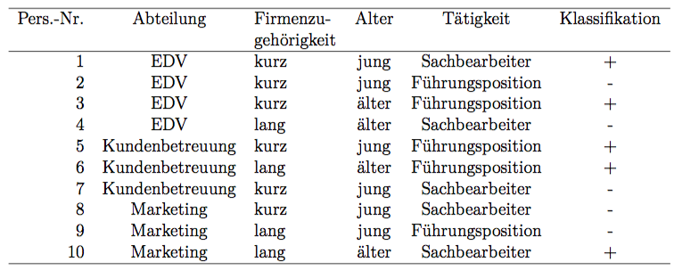
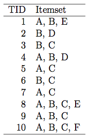
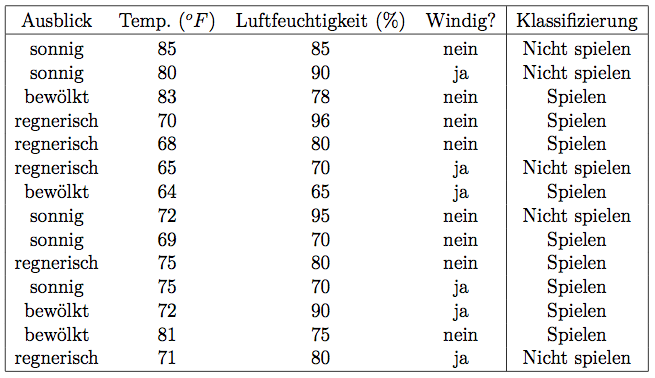

# Übungsblatt 10
## Aufgabe 34: Maschinelles Lernen: Entscheidungsbaum
**Entlassungswelle in einer großen Bank: Aus (nicht ganz) heiterem Himmel bekommen Angestellte ihre Kündigung oder werden an andere Arbeitsplätze versetzt. Im Betriebsrat grübelt man, welche Empfehlungen die kürzlich angeheuerte Unternehmensberatung der Unternehmensführung gegeben haben mag. Folgende Daten über die Entlassungen wurden bisher gesammelt:**

**Kurze Firmenzugehörigkeit heißt hier weniger als fünf Jahre, jung bedeutet jünger als 35. Die
Klassifizierung + bedeutet, dass eine Kündigung oder Versetzung ausgesprochen wurde.**

a) **Bestimmen Sie einen Entscheidungsbaum zur Klassifizierung der Kündigungen bzw. Versetzungen. Gehen Sie bei der Attributauswahl wie folgt vor: Das Attribut, das die meisten Beispiele eindeutig klassifiziert, wird für die nächste Verzweigung ausgewählt. Gibt es kein solches Attribut oder mehrere Attribute mit derselben Anzahl eindeutig klassifizierter Beispiele, gilt die Reihenfolge der Attribute in der Tabelle (von links nach rechts).**

b) **Bestimmen Sie die entsprechenden Entscheidungsregeln.**

c) **Interpretieren Sie das Ergebnis: Wie könnte der Rat der Unternehmensberatung gelautet haben?**

d) **Jemand behauptet, der Unternehmensberatung käme es auf die Abteilungen gar nicht an, sie wolle sowieso nur gewisse Leute loswerden oder sich profilieren. Können Sie diese Behauptung widerlegen?**

*Augaben braucht nicht bearbeitet werden!*

---
## Aufgabe 35: Maschinelles Lernen: Assoziationsregeln
**Gegeben seien folgende Transaktionen:**

a) **Berechnen Sie auf dieser Grundlage die frequent itemsets (minimum support = 0.2). Verwenden Sie hierzu den apriori-Algorithmus.**

Support = Summe der Vorkommen in TID / Anzahl der TID

$C_1$

| Itemset | Support |
| :-----: | :-----: |
|   {A}   |   0,7   |
|   {B}   |   0,8   |
|   {C}   |   0,7   |
|   {D}   |   0,2   |
|   {E}   |   0,2   |
|   {F}   |   0,1   |

$L_1=\{\{A\}, \{B\}, \{C\}, \{D\}, \{E\}\}$

$C_2$

| $C_2-Menge$ | Support || $C_2-Menge$ | Support |
| :---------: | :-----: || :---------: | :-----: |
|    {A,B}    |   0,5   ||    {B,E}    |   0,2   |
|    {A,C}    |   0,5   ||    {C,D}    |   0,0   |
|    {A,D}    |   0,1   ||    {C,E}    |   0,1   |
|    {A,E}    |   0,2   ||    {D,E}    |   0,0   |
|    {B,C}    |   0,5   ||             |         |
|    {B,D}    |   0,2   ||             |         |

$L_2=\{ \{A,B\}, \{A,C\}, \{A,E\}, \{B,C\}, \{B,D\}, \{B,E\}\}$

a,b,c,d,e

$C_3$

| $C_3-Mengen$ | Support || $L_3-Mengen$ |
| :---------:  | :-----: || :----------: |
|   {A,B,C}    |   0,3   ||    {A,B,C}   |
|   {A,B,D}    |   0,1   ||    {A,B,E}   |
|   {A,B,E}    |   0,2   |
|   {A,C,D}    |   0,0   |
|   {A,C,E}    |   0,1   |
|   {A,E,D}    |   0,0   |
|   {B,C,D}    |   0,0   |
|   {B,C,E}    |   0,1   |
|   {B,D,E}    |   0,1   |

$L_4=\emptyset$

b) **Bestimmen Sie aus den frequent itemsets aus Teilaufgabe a) alle Regeln, die einen minimalen Konfidenzwert von 0.8 überschreiten.**

Konfidenz=Anzahl Item(-set)/Item(-set)->Item

|      Regel       | Konfidenz ||   $C_2-Menge$    | Support |
| :--------------: | :-------: || :--------------: | :-----: |
| $A\rightarrow B$ |   0,71    || $B\rightarrow E$ |   0,25  |
| $A\rightarrow C$ |   0,71    || $C\rightarrow D$ |   0,0   |
| $A\rightarrow D$ |   0,14    || $C\rightarrow E$ |   0,14  |
| $A\rightarrow E$ |   0,28    || $D\rightarrow E$ |   0,0   |
| $B\rightarrow C$ |   0,62    ||             |         |
| $B\rightarrow D$ |   0,25    ||             |         |

---
## Aufgabe 36: Maschinelles Lernen: Entscheidungsbaum
**Bestimmen Sie analog zur ersten Aufgabe dieses Übungsblattes einen Entscheidungsbaum der anhand des folgenden Datensatzes das Attribut „Klassifizierung“ bestimmt, welches aussagt, ob es bei den derzeitigen Wetterbedingungen ratsam ist, Tennis zu spielen. Wenn zwei oder mehr Attribute die gleiche Qualität liefern, wählen Sie jenes aus, welches weiter links in der Tabelle steht.**

* Ausblick: sonnig, bewölkt, regnerisch
* Temp.:
* Humidity:
* Windig: ja, nein

 
