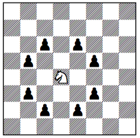
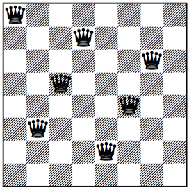
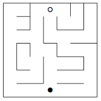
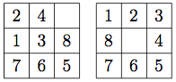
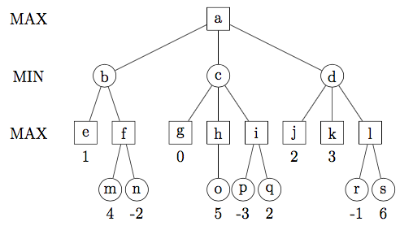
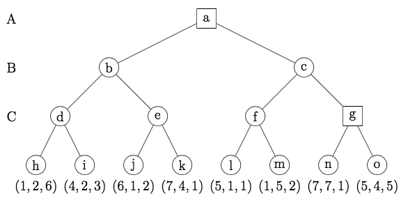

# Übungsblatt 11
## Aufgabe 37: Uninformierte Suche: Springerproblem und n-Damen-Problem
**Wählen Sie eines der beiden im folgenden beschriebenen Probleme. Da das Lösungsprinzip für beide Probleme gleich ist, reicht es, wenn Sie eines der Probleme bearbeiten. Wenn Sie Zeit und Lust haben, können Sie aber natürlich auch beide lösen.**

### Das Springerproblem
**Beim Springerproblem geht es darum, eine Wanderung eines Springers (Figur beim Schachspiel) über ein n×n-Schachbrett zu finden, sodass er jedes Feld genau einmal betritt. (Als erschwerende Bedingung kann man außerdem einführen, dass er von dem letzten Feld seiner Wanderung wieder auf das erste ziehen können, sein Weg also geschlossen sein soll.)**

**Wie ein Springer zieht, ist in dem nebenstehenden Diagramm gezeigt. Der weiße Springer kann auf genau die Felder ziehen, die durch schwarze Bauern (ebenfalls Schachfiguren) markiert sind.**

### Das n-Damen-Problem
**Beim n-Damen-Problem geht es darum, n gleichfarbige Damen (Figur beim Schachspiel, die horizontal, vertikal und diagonal beliebig weit ziehen kann) so auf einem n×n-Schachbrett aufzustellen, dass keine auf einem Feld steht, auf das eine andere ziehen könnte, keine Dame also einer anderen „im Weg steht“. Dürften Figuren gleicher Farbe einander schlagen, könnte man auch sagen: so, dass keine eine andere schlagen kann.**

**Das nebenstehende Diagramm zeigt keine Lösung des 8-Damen-Problems, da nur sieben Damen aufgestellt sind und keine weitere mehr platziert werden kann.**

a) **Geben Sie für das von Ihnen gewählte Problem einen Algorithmus an, der es mithilfe einer Tiefensuche löst!**
*Hinweis: Die Tiefenbeschränkung ergibt sich aus der Problemstellung.*

b) **Geben Sie eine Lösung des Springerproblems oder alle Lösungen des n-Damen-Problems für ein 5×5-Schachbrett an! Warum gibt es keine Lösungen für ein 3×3-Schachbrett?**

---
## Aufgabe 38: Heuristische Suche: Wege in einem Labyrinth
**In dem nebenstehenden Labyrinth soll ein Weg von dem durch ◦ markierten Feld zu dem durch • markierten Feld gefunden werden. Menschen „sehen“ sehr schnell den kürzesten Weg, aber Computerprogramme müssen zur Lösung des Problems eine mitunter aufwendige Suche durchführen. In dieser Aufgabe vergleichen wir eine Breitensuche mit einer heuristischen Suche durch den A*-Algorithmus.**

a) **Führen Sie eine Breitensuche durch (Nachfolgerreihenfolge: Feld im Osten, Norden, Westen, Süden) und tragen Sie in eine Kopie des Labyrinthes ein, im welchem Schritt die einzelnen Felder erreicht werden! Als ein Schritt gilt jedes Erzeugen eines Zustandes des Suchraums. Ein Feld gilt als besucht, sobald der zugehörige Zustand erzeugt wird. Das Ausgangsfeld erhält die Nummer 1.**

b) **Wählen Sie eine geeignete heuristische Schätzfunktion h für die Weglänge zum Zielfeld und tragen Sie in eine Kopie des Labyrinthes die Werte dieser Funktion für die einzelnen Felder ein!**

c) **Führen Sie unter Verwendung der Schätzfunktion h aus Teilaufgabe b) den A*-Algorith- mus aus! Verwenden Sie als Funktion g die Schrittzahl vom Startfeld.**

**Wählen Sie ein geeignetes Kriterium, um den nächsten zu erweiternden Zustand zu bestimmen, wenn es zwei oder mehrere Zustände gibt, für die die Funktion f den gleichen Wert liefert.
Tragen Sie wie in Teilaufgabe a) in eine Kopie des Labyrinthes ein, in welchem Schritt die einzelnen Felder besucht werden.**

---
## Aufgabe 39: Heuristische Suche: Qualität der Heuristik
**Hier wird das 8-Puzzle betrachtet, bei dem acht mit Zahlen beschriftete Quadrate durch Verschieben in einem 3×3-Rahmen in die richtige Lage gebracht werden müssen. Nebenstehend sind ein Startzustand (links) und der Zielzustand (rechts) gezeigt. Wie leicht ein Computerprogramm die Lösung findet, hängt von der verwendeten Heuristik ab: Mit einer guten Heuristik wird die Lösung wesentlich schneller gefunden. Dies soll diese Aufgabe zeigen.**

**Führen Sie den Anfang einer heuristischen Suche mit dem A*-Algorithmus durch! Verwenden Sie als Funktion g die Anzahl Züge von der Ausgangsstellung und als Schätzfunktion h**

a) **die Anzahl der Zahlen, die sich an einer falschen Position befinden,**

b) **die Summe der Manhattan-/City-Block-Abstände der Zahlen von ihren Zielpositionen.**

**Erzeugen Sie etwa 20 Zustände, sodass die Wirkung der unterschiedlichen Heuristiken deutlich wird.**

---
## Aufgabe 40: Minimax-Prinzip und Alpha-Beta-Stutzen
**Gegeben sei der folgende Spielbaum:**

a) **Bestimmen Sie anhand des Minimax-Prinzips die optimale Spielsequenz, sowie die Bewertung des erreichten Endzustandes.**

b) **Welche Knoten müssen durch α-β-Stutzen nicht besucht werden?**

c) **Abweichend sei nun folgendes 3-Personen-Spiel gegeben. Es spielen reihum A, B und C.**

**Die Auszahlung bei Spielende sei in Vektorform gegeben:**
$$(Auszahlung_A,Auszahlung_B,Auszahlung_C)$$

**Lösen sie folgenden Spielbaum:**

